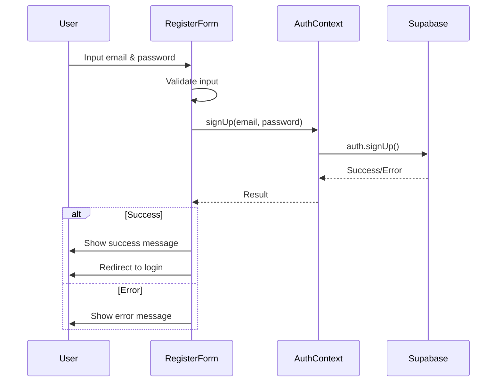
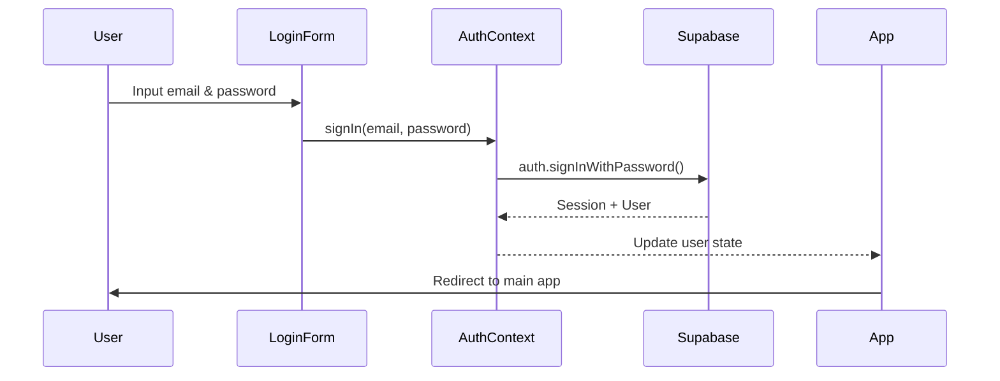
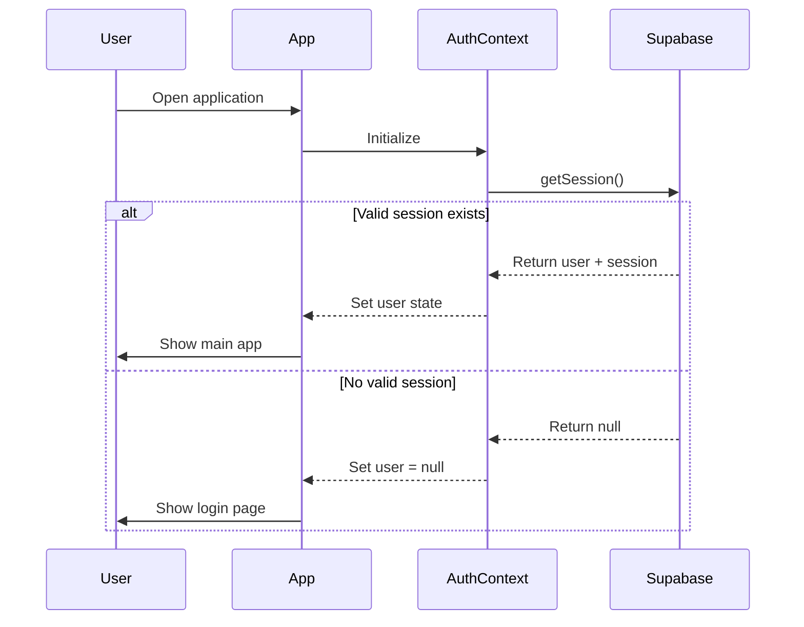
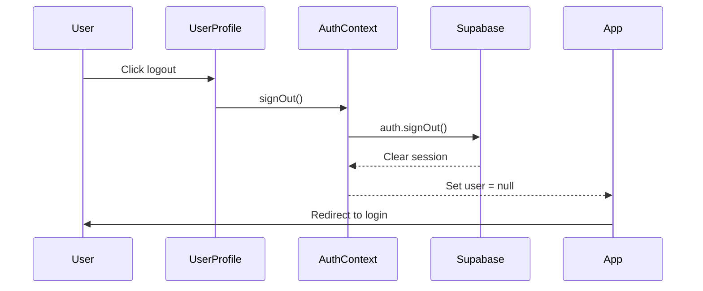

# Design Document - Supabase Authentication & Login

## Overview

Fitur autentikasi ini akan mengintegrasikan Supabase Auth ke dalam aplikasi Kids Worksheet Generator. Sistem akan menggunakan email/password authentication dengan session management otomatis. Design ini fokus pada implementasi yang sederhana namun aman, dengan UI yang user-friendly.

## Architecture

### High-Level Architecture

```
┌─────────────────┐
│   React App     │
│   (App.tsx)     │
└────────┬────────┘
         │
         ├──────────────────┐
         │                  │
┌────────▼────────┐  ┌──────▼──────────┐
│  Auth Context   │  │  Main Content   │
│  (AuthProvider) │  │  (Worksheet UI) │
└────────┬────────┘  └─────────────────┘
         │
┌────────▼────────┐
│  Auth UI        │
│  - LoginForm    │
│  - RegisterForm │
│  - UserProfile  │
└────────┬────────┘
         │
┌────────▼────────┐
│  Supabase       │
│  Auth Client    │
└─────────────────┘
```

### Component Structure


1. **AuthContext** (`lib/AuthContext.tsx`)
   - Menyediakan state dan methods untuk autentikasi
   - Mengelola user session
   - Menyediakan loading state

2. **AuthProvider** (wrapper component)
   - Membungkus aplikasi untuk menyediakan auth context
   - Mendengarkan perubahan auth state dari Supabase

3. **LoginPage** (`components/LoginPage.tsx`)
   - Form login dengan email dan password
   - Link ke halaman register
   - Error handling dan validation

4. **RegisterPage** (`components/RegisterPage.tsx`)
   - Form registrasi dengan email dan password
   - Password confirmation
   - Link ke halaman login

5. **UserProfile** (`components/UserProfile.tsx`)
   - Menampilkan email user di header
   - Tombol logout
   - Avatar/initial user

6. **ProtectedRoute** (logic dalam App.tsx)
   - Redirect ke login jika belum authenticated
   - Menampilkan main app jika sudah authenticated

## Components and Interfaces

### AuthContext Interface

```typescript
interface AuthContextType {
  user: User | null;
  loading: boolean;
  signUp: (email: string, password: string) => Promise<void>;
  signIn: (email: string, password: string) => Promise<void>;
  signOut: () => Promise<void>;
}
```

### User Type (dari Supabase)

```typescript
import { User } from '@supabase/supabase-js';
// User sudah include: id, email, created_at, dll
```


## Data Models

### Supabase Auth Tables

Supabase Auth secara otomatis mengelola tabel `auth.users` dengan struktur:
- `id` (UUID): Primary key
- `email` (string): Email pengguna
- `encrypted_password` (string): Password terenkripsi
- `email_confirmed_at` (timestamp): Waktu konfirmasi email
- `created_at` (timestamp): Waktu pembuatan akun
- `updated_at` (timestamp): Waktu update terakhir

Tidak perlu membuat tabel custom untuk autentikasi dasar.

### Session Storage

Supabase secara otomatis menyimpan session token di:
- LocalStorage (default)
- Key: `supabase.auth.token`

## Authentication Flow

### Registration Flow



### Login Flow




### Session Persistence Flow



### Logout Flow



## UI Design

### Login Page Layout

```
┌─────────────────────────────────────┐
│                                     │
│         📝 Kids Worksheet           │
│            Generator                │
│                                     │
│    ┌─────────────────────────┐    │
│    │  Masuk ke Akun Anda     │    │
│    │                         │    │
│    │  Email:                 │    │
│    │  [________________]     │    │
│    │                         │    │
│    │  Password:              │    │
│    │  [________________]     │    │
│    │                         │    │
│    │  [    Masuk    ]        │    │
│    │                         │    │
│    │  Belum punya akun?      │    │
│    │  Daftar di sini         │    │
│    └─────────────────────────┘    │
│                                     │
└─────────────────────────────────────┘
```


### Register Page Layout

```
┌─────────────────────────────────────┐
│                                     │
│         📝 Kids Worksheet           │
│            Generator                │
│                                     │
│    ┌─────────────────────────┐    │
│    │  Buat Akun Baru         │    │
│    │                         │    │
│    │  Email:                 │    │
│    │  [________________]     │    │
│    │                         │    │
│    │  Password:              │    │
│    │  [________________]     │    │
│    │                         │    │
│    │  Konfirmasi Password:   │    │
│    │  [________________]     │    │
│    │                         │    │
│    │  [    Daftar    ]       │    │
│    │                         │    │
│    │  Sudah punya akun?      │    │
│    │  Masuk di sini          │    │
│    └─────────────────────────┘    │
│                                     │
└─────────────────────────────────────┘
```

### User Profile Component (di Header)

```
┌─────────────────────────────────────┐
│  📝 Kids Worksheet Generator        │
│                                     │
│                    ┌──────────────┐ │
│                    │ 👤 user@...  │ │
│                    │ [Logout]     │ │
│                    └──────────────┘ │
└─────────────────────────────────────┘
```

## Error Handling

### Error Types dan Messages

1. **Invalid Email Format**
   - Message: "Format email tidak valid"
   - Trigger: Client-side validation

2. **Password Too Short**
   - Message: "Password minimal 6 karakter"
   - Trigger: Client-side validation

3. **Email Already Registered**
   - Message: "Email sudah terdaftar. Silakan login."
   - Trigger: Supabase error pada signUp

4. **Invalid Credentials**
   - Message: "Email atau password salah"
   - Trigger: Supabase error pada signIn

5. **Network Error**
   - Message: "Koneksi gagal. Periksa internet Anda."
   - Trigger: Network failure

6. **Password Mismatch**
   - Message: "Password tidak cocok"
   - Trigger: Client-side validation (register)


### Error Handling Strategy

```typescript
// Centralized error handler
const handleAuthError = (error: any): string => {
  if (error.message.includes('Invalid login credentials')) {
    return 'Email atau password salah';
  }
  if (error.message.includes('User already registered')) {
    return 'Email sudah terdaftar. Silakan login.';
  }
  if (error.message.includes('Email not confirmed')) {
    return 'Silakan konfirmasi email Anda terlebih dahulu';
  }
  return 'Terjadi kesalahan. Silakan coba lagi.';
};
```

## Testing Strategy

### Unit Tests (Optional)

1. **AuthContext Tests**
   - Test signUp function
   - Test signIn function
   - Test signOut function
   - Test session persistence

2. **Form Validation Tests**
   - Test email validation
   - Test password validation
   - Test password confirmation matching

### Integration Tests (Optional)

1. **Login Flow Test**
   - User dapat login dengan kredensial valid
   - User tidak dapat login dengan kredensial invalid
   - Session tersimpan setelah login

2. **Registration Flow Test**
   - User dapat mendaftar dengan email baru
   - User tidak dapat mendaftar dengan email yang sudah ada
   - Validation bekerja dengan benar

3. **Logout Flow Test**
   - User dapat logout
   - Session terhapus setelah logout
   - User redirect ke login page

### Manual Testing Checklist

- [ ] Register dengan email baru berhasil
- [ ] Register dengan email yang sudah ada menampilkan error
- [ ] Login dengan kredensial benar berhasil
- [ ] Login dengan kredensial salah menampilkan error
- [ ] Session persist setelah refresh browser
- [ ] Logout berhasil dan redirect ke login
- [ ] Protected routes tidak bisa diakses tanpa login
- [ ] Email validation bekerja
- [ ] Password validation bekerja
- [ ] Error messages ditampilkan dengan jelas


## Security Considerations

### Best Practices

1. **Password Security**
   - Minimum 6 karakter (Supabase default)
   - Password tidak pernah disimpan di client-side
   - Supabase menggunakan bcrypt untuk hashing

2. **Session Management**
   - Token disimpan di localStorage (Supabase default)
   - Token auto-refresh sebelum expired
   - Session timeout sesuai konfigurasi Supabase

3. **HTTPS**
   - Semua komunikasi dengan Supabase menggunakan HTTPS
   - Environment variables untuk API keys

4. **Input Validation**
   - Client-side validation untuk UX
   - Server-side validation oleh Supabase
   - Sanitize input untuk mencegah XSS

### Environment Variables

```env
VITE_SUPABASE_URL=https://your-project.supabase.co
VITE_SUPABASE_ANON_KEY=your-anon-key
```

**Note**: Anon key aman untuk digunakan di client-side karena Row Level Security (RLS) di Supabase melindungi data.

## Implementation Notes

### Supabase Configuration

1. **Email Settings** (di Supabase Dashboard)
   - Enable email confirmation (optional untuk MVP)
   - Customize email templates
   - Set redirect URLs

2. **Auth Providers**
   - Email/Password (primary)
   - Social providers dapat ditambahkan nanti (Google, GitHub, dll)

3. **Security Settings**
   - JWT expiry time: 3600 seconds (default)
   - Refresh token rotation: enabled
   - Site URL: production domain

### Styling Approach

Menggunakan Tailwind CSS yang sudah ada di project dengan tema yang konsisten:
- Gradient backgrounds (purple, pink, blue)
- Rounded corners (rounded-xl, rounded-2xl)
- Shadow effects (shadow-lg, shadow-2xl)
- Hover animations (hover:scale-105)
- Focus rings (focus:ring-4)

### File Structure

```
src/
├── lib/
│   ├── supabase.ts (existing)
│   └── AuthContext.tsx (new)
├── components/
│   ├── LoginPage.tsx (new)
│   ├── RegisterPage.tsx (new)
│   └── UserProfile.tsx (new)
└── App.tsx (modified)
```

## Design Decisions

### Why Context API?

- Sederhana untuk aplikasi kecil-menengah
- Tidak perlu library tambahan (Redux, Zustand)
- Built-in React feature
- Mudah di-maintain

### Why Email/Password First?

- Paling sederhana untuk MVP
- Tidak perlu OAuth setup
- User familiar dengan flow ini
- Dapat ditambahkan social login nanti

### Why Not Email Confirmation for MVP?

- Mempercepat development
- Mengurangi friction untuk user testing
- Dapat diaktifkan nanti di production
- Supabase support toggle on/off

### Styling Consistency

- Menggunakan style yang sama dengan existing components
- Gradient backgrounds untuk consistency
- Emoji icons untuk friendly UX
- Responsive design untuk mobile
